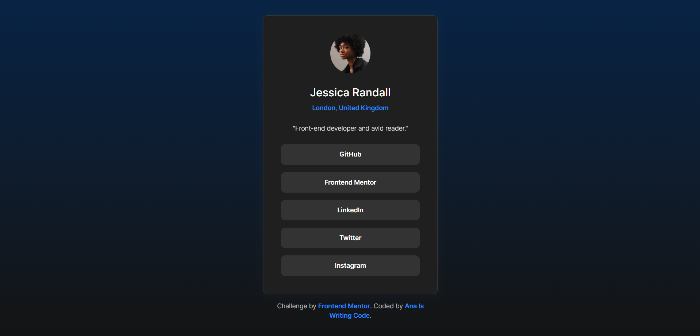

# Social links profile (ocean theme) | Frontend Mentor

This is a solution to the [Social links profile challenge on Frontend Mentor](https://www.frontendmentor.io/challenges/social-links-profile-UG32l9m6dQ/hub) that takes **responsive design** into account.

## Table of contents

- [Overview](#overview)
- [My process](#my-process)
- [Author](#author)

## Overview

The challenge required that users should be able to:

- See hover states for interactive elements

## My process

In this project I implemented:

- BEM notation
- Custom CSS properties
- Media queries
- Mobile-first approach
- Semantic HTML
- Responsive design

## Author

- GitHub - [@anaiswritingcode](https://github.com/anaiswritingcode)
- Frontend Mentor - [@anaiswritingcode](https://www.frontendmentor.io/profile/anaiswritingcode)
- Codecademy - [@anaiswritingcode](https://www.codecademy.com/profiles/anaiswritingcode)
